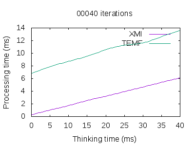
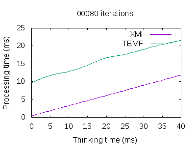
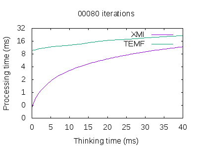
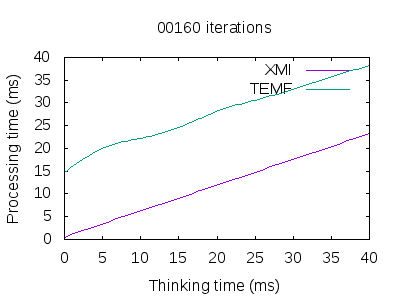
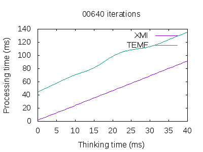
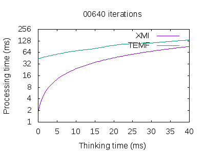
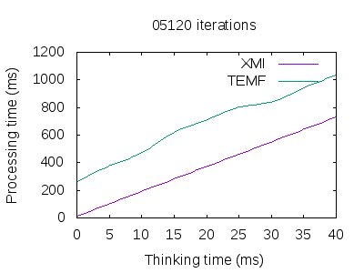
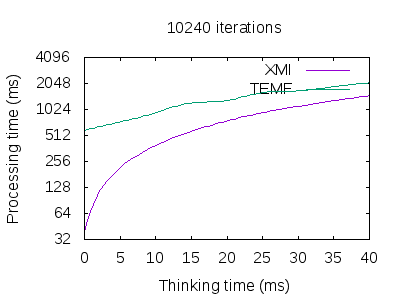
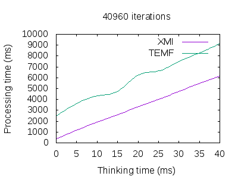
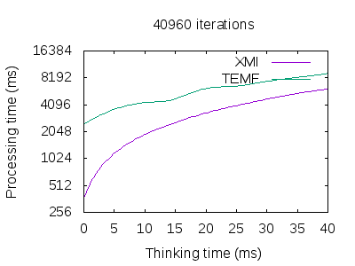

# Execution Times - 2GB Heap

## Contents:

* Diretory `benchmark-instances`: Instances used for the simulations.
* Directories `singlearea-fullhistory-<processingTime>-<iterations>`: Directoty with the execution logs for the combination simulation parameters *processing time* and *iterations*.
* Script `gather-exec-times.sh`: Script that analyzes the logs, and generates the `*.dat` files and the plots.
* Files `time-<iterations>.dat`: Files with the execution times with varying *processing time* and fixed *iterations*.
* Files `time-<iterations>-linear.png` and `time-<iterations>-log2.png`: Plots for the exeuction times for a specific number of iterations, using a *linear* and *log2* scale in the Y axis respectively.

## Results

### 20 iterations

### 40 iterations

### 80 iterations

### 160 iterations

### 320 iterations

### 640 iterations

### 1280 iterations

### 2560 iterations

### 5120 iterations

### 10240 iterations

### 20480 iterations

### 40960 iterations

