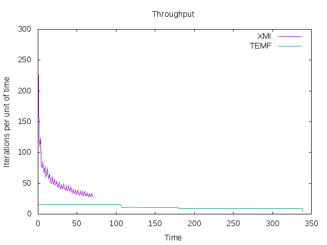

# Memory Usage and Query Time - 512MB eap

## Contents:

* Directory `benchmark-instances`: Instances used for the simulations.

* Directories `memory-singlearea-fullhistory-00-<iterations>`: Directoty with the execution logs for the simulations with varying *iterations* for *StandardEMF* (*processing time* is set to 0, since we are not measuring execution time, and want to run the simulation as fast as possible.).

* Directories `memory-singlearea-fullhistory-00-<iterations>`: Directoty with the execution logs for the simulations with varying *iterations* for *TemporalEMF* (*processing time* is set to 0, since we are not measuring execution time, and want to run the simulation as fast as possible.).

* Files `memorytime-<iterations>.dat`: Files with the memory used in at regular intervals (in the current experiments, every 20 seconds).

* Files `memorytime-<iterations>.png`: Plot files generated from the corresponding `memorytime-<iterations>.dat` files.

* Files `memoryiterations-<iterations>.dat`: Files with the memory used and the closest iteration number (the one with the closest timestamp). Both timestamps (when the memory usage was logged and when the iteration was logged) are also included.

* Files `memoryiterations-<iterations>.png`: Plot files generated from the corresponding `memoryiterations-<iterations>.dat` files.

* Files `iterationstime-<iterations>.dat`: Number of iterations of the simulation that were executed per unit of time (i.e., every 20 seconds). Used to measure the throughput.

* Files `iterationstime-<iterations>.png`: Plot files generated from the corresponding `iterationstime-<iterations>.dat` files.

* File `simmemory.dat`: Memory usage after the simulation. Memory consumption is measured before and after saving the Resource containing the simulated model, and after requesting the Garbage Collector for three times.

* Files `simmemory.png`: Plot generated from `simmemory.dat`.

* File `querytime.dat`: Execution times for the queries Q1-Q4.

## Results

**NOTE:** Only plots for more than 10240 are shown below, since logs for shorter simulations do not contain enough data.

### 10240 iterations

### 20480 iterations

### 40960 iterations

### 81920 iterations

### 163840 iterations

### 327680 iterations

### Final memory usage

Memory usage after running the simulation (X Axis = number of iterations; Y Axis = Ocuppied memory before/after saving into disk).

### Query execution times

See [querytime.dat](querytime.dat)

